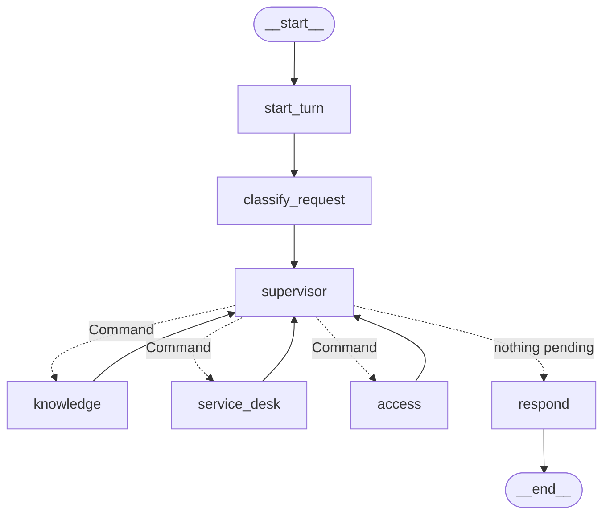

# Agent design

How AegisDesk's agents are organised and what each may do. The learning notes with traces are in [milestones/M4-multi-agent.md](milestones/M4-multi-agent.md).

## Topology



Each specialist node runs its own compiled tool-agent subgraph:

```
start_turn → call_model ⇄ run_tools (ToolExecutor) → END / limit_reached
```

## Agents

| Agent | Version | Prompt | Tools | Writes | Answer check |
|---|---|---|---|---|---|
| Supervisor | 0.1.0 | `router@v1` (structured `RoutingPlan`) | none | none | n/a |
| Knowledge | subgraph | `knowledge@v1` | search_knowledge_base, retrieve_document, request_handoff | none | citations ⊆ chunks retrieved in this run; evidence ⇒ at least one citation |
| Service Desk | subgraph | `service_desk@v3` | get_my_assets, list_my_tickets, get_ticket, create_ticket, add_ticket_comment (M5), search_knowledge_base, request_handoff | create_ticket, add_ticket_comment (MEDIUM, idempotent) | none yet |
| Access | subgraph | `access@v1` | get_employee_profile, list_my_access, get_application, check_access_eligibility, create_access_request, request_handoff | create_access_request (MEDIUM, idempotent, eligibility recomputed) | none yet |

A single-agent engine (`service_desk@v2`, M2/M3) and the M1 loop are kept for comparison.

## Rules that hold regardless of model output

1. **Identity** comes from the authenticated session (`UserContext`) and is passed by code. No tool has an employee-ID parameter, and all schemas forbid extra fields (ADR 0003).
2. **Tools** are allowlisted per agent by its `ToolExecutor`. Anything else returns `unknown_tool`.
3. **Routing** is limited to the declared agents (enum), at most 3 tasks from the router plus at most `AGENT_MAX_HANDOFFS` (default 2) from handoffs, never a handoff to oneself or a duplicate task.
4. **Loops** are bounded per specialist (`AGENT_MAX_STEPS`, `AGENT_MAX_TOOL_CALLS`) and per turn (LangGraph `recursion_limit`).
5. **Context** is isolated: specialists receive the visible conversation plus their task; their tool traffic is never shared or persisted.
6. **Writes** are idempotent per request. Access eligibility is recomputed by the tool; access is never granted by an agent.
7. **Threads** belong to the employee who started them; access is checked before anything is written.

## Handoff protocol

```
specialist ──request_handoff(target, instruction)──► (tool records it, does nothing)
parent node reads the specialist's trajectory:
    target ≠ self (schema) ∧ not a duplicate ∧ handoffs < budget ∧ plan has room
        ├─ yes → append {agent: target, instruction, source: "handoff:<from>"}; handoffs += 1
        └─ no  → note on the trajectory ("refused (budget exhausted)", "ignored (duplicate)")
supervisor picks the next pending task
```

## Answer composition

* No tasks: out-of-scope message, or a "please rephrase" message after a routing error.
* One task: the specialist's answer, unchanged (no extra model call).
* Several tasks: sections in plan order, joined by code, so no new facts can be introduced.

## Trajectory

`AgentRun.trajectory` records, in order:

* `RouteStep`: tasks, out-of-scope flag, error, tokens and latency;
* the specialists' `ModelStep` and `ToolStep` entries, each tagged with `agent`;
* one `AgentStep` per task: status (`done` | `incomplete` | `failed`), the answer, and a note (handoffs, citation rejections).

This is the input for traces (M8) and trajectory evaluations (M9).

## Tools over MCP (Milestone 5)

The tool sets above are the per-agent allowlist whichever `TOOL_TRANSPORT` is used. With MCP, enterprise tools execute on the read or action server and each call carries the specialist's `AgentIdentity` in a signed delegation token; knowledge tools and `request_handoff` stay in-process. See [MCP_DESIGN.md](MCP_DESIGN.md).
