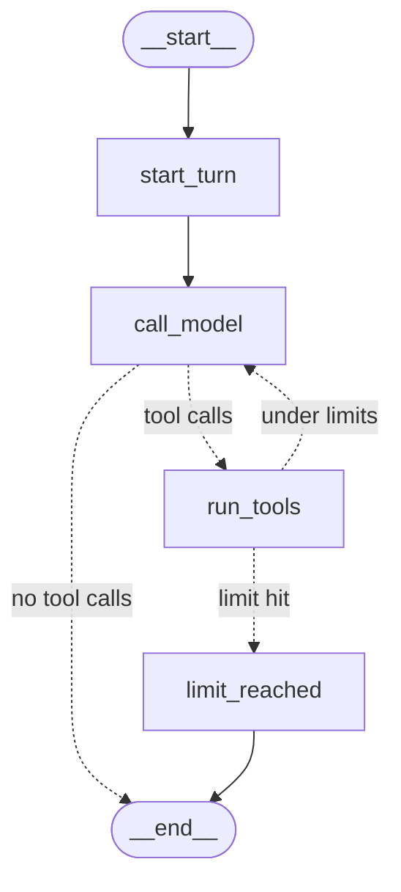

# AegisDesk architecture

This document describes the **target** architecture and marks what has been built so far. It is updated at every milestone.

| Milestone | Status |
|---|---|
| M0 LLM fundamentals | ✅ built ([notes](milestones/M0-llm-fundamentals.md)) |
| M1 Single agent + local tools | ✅ built ([notes](milestones/M1-single-agent-tools.md)) |
| M2 LangGraph | ✅ built ([notes](milestones/M2-langgraph.md)) |
| M3 RAG | ✅ built ([notes](milestones/M3-rag.md), [design](RAG_DESIGN.md)) |
| M4 Multi-agent | ✅ built ([notes](milestones/M4-multi-agent.md), [design](AGENT_DESIGN.md)) |
| M5 MCP | ✅ built ([notes](milestones/M5-mcp.md), [design](MCP_DESIGN.md)) |
| M6 Governance | ✅ built ([notes](milestones/M6-governance.md), [design](GOVERNANCE_DESIGN.md)) |
| M7 Human approval | ✅ built ([notes](milestones/M7-approvals.md), [design](APPROVALS_DESIGN.md)) |
| M8 Observability | ✅ built ([notes](milestones/M8-observability.md), [design](OBSERVABILITY.md)) |
| M9 Evaluations | not started |
| M10 API + UI | not started |
| M11 Reliability | not started |
| M12 CI/CD | partial: lint, type and unit-test gates run in CI from M0 |

## Guiding principle

LLMs do probabilistic reasoning. Deterministic software does authentication, authorization, policy, approval enforcement, validation, business rules, persistence, audit and retries. **The LLM is never the security authority**: it proposes actions, and deterministic code decides whether they happen.

```
AI reasoning   ──proposes──►   Business workflow   ──guarded by──►   Governance / policy enforcement
 (agents)                       (graph, tools)                        (identity, OPA, approvals, audit)
```

## Logical architecture (target)

```
 Employee / Manager
        │
        ▼
 ┌──────────────┐     ┌────────────────────────────────────────────────────────┐
 │ Streamlit UI │────►│ FastAPI  (threads, messages, approvals, health, metrics)│
 └──────────────┘     └──────────────────────────┬─────────────────────────────┘
                                                 │ trusted identity claims
                                                 ▼
                      ┌──────────────────────────────────────────────┐
                      │ LangGraph main graph (checkpointed state)     │
                      │  supervisor ─► knowledge | service_desk | access│
                      └───────┬───────────────────────┬──────────────┘
                              │ tool requests          │ retrieval
                              ▼                        ▼
                     ┌─────────────────┐       ┌──────────────┐
                     │  Tool Gateway   │       │ RAG retriever │──► pgvector
                     │  + Policy (OPA) │       └──────────────┘
                     └───┬───────┬─────┘
                ALLOW    │  DENY │  APPROVAL ──► interrupt ──► manager ──► resume
                         ▼
          ┌──────────────────────────────┐
          │ MCP servers: read  | action  │──► PostgreSQL (employees, assets, tickets, access…)
          └──────────────────────────────┘

 Cross-cutting: model layer (M0) · audit events · OpenTelemetry + LangSmith · evals
```

## What exists after M8

### Observability

```
spans · metrics · JSON logs ──(RedactingSpanProcessor)──► OTLP ─► Collector ─┬─► Tempo ──┐
     one trace per request, across MCP (traceparent in _meta)               └─► Prometheus┴─► Grafana
     trace_id also in audit_events                         optional: LangSmith (redacted)
```

* **Observability** (`src/aegisdesk/observability/`, `infra/observability/`): OpenTelemetry spans at every seam (request, router/model calls, specialists, tools, policy, MCP client and server, retrieval, approvals) with GenAI semantic-convention attributes; the §24 metrics; JSON logs with trace context; optional LangSmith; allowlist redaction; injected faults for debugging practice. See [OBSERVABILITY.md](OBSERVABILITY.md) and [ADR 0013](adr/0013-opentelemetry-langsmith-redaction.md).

From M7:

### Approval workflow

```
access agent ─► create_access_request ─► request + approval steps (store)
respond ─► await_approval ─► INTERRUPT (checkpoint)  ···  manager: approvals approve AP-… (checks, audit)
                ▲    │                                              │ resume(thread)
     still waiting    └─ all decided (store) ─► apply_approvals ◄───┘
                                                 provision_access as access_workflow
                                                 (HIGH: gateway requires store-found approval evidence)
```

* **Approvals** (`src/aegisdesk/approvals/`, `domain/access_store*.py`, migration 0003): steps created with the request; decisions by the named manager or role holder, with separation of duties, expiry and idempotency; the resumed workflow provisions through the gateway. Durable with `DATA_STORE=postgres` and `CHECKPOINT_STORE=postgres`. See [APPROVALS_DESIGN.md](APPROVALS_DESIGN.md), [ADR 0011](adr/0011-approval-interrupt-resume.md) and [ADR 0012](adr/0012-postgres-for-workflow-state.md).

From M6:

### Governance: every tool call

```
tool request ─► allowlist ─► schema ─► ACTION GATEWAY ────────────────► handler ─► audit outcome
                                        policy(agent, user, tool, env)
                                        audit decision (before anything runs)
                                        DENY → policy_denied · HIGH → approval_required (M7)
```

* **Policy** (`config/policy.yaml`, `src/aegisdesk/governance/`): risk classes, per-agent grants, authorized writes, forbidden actions, environment rules. Deterministic engine, fail closed, all deny reasons reported. See [GOVERNANCE_DESIGN.md](GOVERNANCE_DESIGN.md) and [ADR 0009](adr/0009-deterministic-policy-engine.md).
* **Enforcement points:** the host's `ToolExecutor` for local tools, and the MCP servers for enterprise tools, using the agent from the verified token.
* **Audit** (`src/aegisdesk/audit/`, migration 0002): decision + outcome events per call. In PostgreSQL, triggers reject UPDATE, DELETE and TRUNCATE. See [ADR 0010](adr/0010-append-only-audit-store.md).

From M5:

### MCP interactions

```
 Host process (CLI)                                         MCP servers (in-process or `aegisdesk mcp serve`)
 ─────────────────                                          ────────────────────────────────────────────────
 specialist agent ── ToolRunner ──┬─ local ToolExecutor     knowledge search/retrieve, request_handoff
   (AgentIdentity)                │
                                  ├─ RemoteToolRunner ─ tools/call + _meta{JWT aud=read}   ─► aegisdesk-read
                                  │    allowlist · token per call · timeout · 1 retry          verify token → ToolExecutor
                                  └─ RemoteToolRunner ─ tools/call + _meta{JWT aud=action} ─► aegisdesk-action
                                       allowlist · token per call · timeout · no retry         verify token → ToolExecutor
```

* **MCP** (`src/aegisdesk/mcp_servers/`, `tools/remote.py`, `tools/transport.py`, `identity/tokens.py`): enterprise tools behind a read server and an action server. Each call carries a short-lived signed delegation token (user claims, RFC 8693 `act` agent claim, request ID, server audience). Servers trust only the token. `TOOL_TRANSPORT` chooses `local`, `mcp_inprocess` or `mcp_http`; agents do not change. See [MCP_DESIGN.md](MCP_DESIGN.md) and [ADR 0008](adr/0008-mcp-servers-with-delegation-tokens.md).

From M4:

### Multi-agent topology (default engine)

```
aegisdesk agent --as E1004 --thread T "..."
   │  authenticate() → UserContext · thread ownership check · SQLite checkpointer (visible turns only)
   ▼
start_turn → classify_request ──(LLM: RoutingPlan{tasks, out_of_scope})──► supervisor (code, no tools)
                                                               Command(goto) │  ▲
          ┌─────────────────────────┬────────────────────────────┬──────────┘  │ back after each task
          ▼                         ▼                            ▼             │
   knowledge subgraph        service_desk subgraph         access subgraph ────┘
   search, retrieve_doc,     assets, tickets,              profile, my access, application,
   handoff                   create_ticket, search,        eligibility, create_access_request,
   + citation check (code)   handoff                       handoff (eligibility recomputed)
          │                         │                            │
          └──── each: its own prompt, its own ToolRunner, its own state ───────┘
                                   │
                              respond (1 answer → as is; several → sections joined by code)
```

* **Agents** (`src/aegisdesk/agents/supervisor.py`, `graphs/supervisor_graph.py`): see [AGENT_DESIGN.md](AGENT_DESIGN.md) and [ADR 0007](adr/0007-specialised-agents-deterministic-supervisor.md). Tool sets are fixed per agent. Handoffs are requests to the supervisor, bounded by a budget. Specialist context is isolated.
* **Access domain** (`domain/access.py`, `tools/access.py`): deterministic eligibility; requests are recorded as `awaiting_approval` or `auto_approved`, and never granted by an agent.

### Single-agent engine (M2/M3, kept for comparison: `--engine graph`)

```
aegisdesk agent --as E1004 --thread T "..."
      │
      ├─► authenticate() ─────────────► UserContext (trusted, built before the model runs)
      │                                       │
      ├─► thread ownership check (before anything is written)
      ▼                                       ▼
ServiceDeskGraphAgent (LangGraph) ──────► ToolExecutor ──┬► Service Desk tools ──► in-memory repository
      │   start_turn → call_model ⇄ run_tools     lookup ·   │                          (data/seed/*.json)
      │   → limit_reached / END                   validate · └► Knowledge tools ──► Retriever ──► VectorStore
      │   state checkpointed after every node     identity     (search_knowledge_base,  │ access    (memory | pgvector)
      │        └──► SqliteSaver                                  retrieve_document)     │ filter
      ▼                                                                                 ▼
BaseChatModel.bind_tools(...) ◄── build_chat_model(Settings, allowlist)             Embedder
                                    ├── ChatAnthropic   (hosted)                    (hashing | Ollama)
prompts/service_desk/v2.yaml        ├── ChatOllama      (local)
                                    └── ScriptedChatModel (offline fake, tests)

aegisdesk ask ──► GroundedAnswerer: Retriever ─► no evidence? stop : context ─► LLM ─► verify citations

(ToolCallingAgent, the M1 hand-written loop, is kept as a reference: `--engine loop`.)
```

### RAG pipeline

```
ingest:  documents/*.md ─► validate metadata ─► clean ─► chunk (by heading, IDs DOC-X-NNN#NN)
                        ─► embed (768-d) ─► store (one transaction per document; Alembic schema)
query:   question + UserContext ─► embed ─► search top-k WHERE access rule ─► score ≥ min_score
                        ─► <documents> context ─► structured answer ─► citations ⊆ retrieved
```

* **RAG** (`src/aegisdesk/rag/`): details in [RAG_DESIGN.md](RAG_DESIGN.md); decisions in [ADR 0005](adr/0005-postgresql-pgvector.md) (PostgreSQL + pgvector) and [ADR 0006](adr/0006-embeddings.md) (embeddings). Access control is enforced inside the vector query, before ranking. Retrieved text is untrusted data; the M1 tool boundary still decides what can happen.
* **Evaluation** (`evals/datasets/`, `src/aegisdesk/evals/`): deterministic retrieval metrics with a CI gate (0 access violations, hit rate ≥ 0.85).

### LangGraph topology



* **Graph** (`src/aegisdesk/graphs/`): typed `ServiceDeskState`; our own nodes, with no prebuilt `ToolNode`, so tools always run through `ToolExecutor`; routing in plain Python conditional edges; streaming per node. See [ADR 0004](adr/0004-why-langgraph.md).
* **Threads** (`src/aegisdesk/persistence/`): the SQLite checkpointer saves state after every node, so conversations survive restarts. Threads belong to the employee who started them; others are refused before anything is written.

From M1:

* **Agent loop** (`src/aegisdesk/agents/loop.py`, now the reference engine): the model proposes tool calls, and the application validates and executes them, feeds the results back, and stops at a final answer or a hard limit. Every run returns its trajectory, token usage and request ID.
* **Tools** (`src/aegisdesk/tools/`): Pydantic input and output schemas, plus risk, read/write, idempotency and owner metadata. Model-facing schemas contain **no identity parameters**, because the user comes from `UserContext` ([ADR 0003](adr/0003-tools-take-identity-from-trusted-context.md)).
* **Security boundary, first version:** tool allowlist per agent, strict argument validation, ownership checks, idempotent writes, error shaping and loop limits. It is enforced in code and tested with a scripted malicious model (`tests/security/`). M6 moves the per-tool checks into a central gateway with OPA.

From M0:

* **Model layer** (`src/aegisdesk/llm/`): the only code that knows about providers. Everything above it depends on `BaseChatModel` and `LLMClient`. See [ADR 0002](adr/0002-provider-agnostic-model-layer.md).
* **Model policy:** `config/models.yaml` allowlist, enforced at construction.
* **Prompts:** versioned YAML files. Each call records `prompt_name` and `prompt_version`.
* **Per-call metadata:** provider, model, prompt version, input and output tokens, latency. These are the seeds of later traces, metrics and evaluation records.

## Repository layout

The spec's layout (§36) is followed inside a single installable package, `src/aegisdesk/`. Subpackages are added in the milestone that needs them, rather than created empty up front:

| Spec directory | Location | Introduced |
|---|---|---|
| `prompts/` | `prompts/` (data), `src/aegisdesk/prompts/` (loader) | M0 |
| model abstraction | `src/aegisdesk/llm/` | M0 |
| `tools/` | `src/aegisdesk/tools/` | M1 |
| `identity/` | `src/aegisdesk/identity/` (simulated login; OIDC later) | M1 |
| `data/seed/` | `data/seed/` | M1 |
| `graphs/`, `agents/` | `src/aegisdesk/graphs/`, `src/aegisdesk/agents/` | M1–M2; supervisor + specialists M4 |
| `rag/` | `src/aegisdesk/rag/`; documents in `data/documents/` | M3 |
| `mcp_servers/` | `src/aegisdesk/mcp_servers/`; client side in `src/aegisdesk/tools/remote.py` | M5 |
| `governance/` | `src/aegisdesk/governance/` (policy data in `config/policy.yaml`); audit in `src/aegisdesk/audit/` | M6 |
| `persistence/` | `src/aegisdesk/persistence/` (checkpointer) | M2 |
| `migrations/` | `migrations/` (Alembic), `alembic.ini` | M3 |
| `approvals/` | `src/aegisdesk/approvals/` | M7 |
| `observability/`, `infrastructure/` | `src/aegisdesk/observability/`, `infra/observability/` (+ Grafana dashboards) | M8 |
| `evals/` | `evals/datasets/` (data), `src/aegisdesk/evals/` (evaluators) | M3 (retrieval); M9 (full suite) |
| `apps/api`, `apps/ui` | … | M10 |

## Diagrams still to come

Written as each milestone lands: workflow (M7), observability architecture (M8), evaluation lifecycle (M9).

## Decisions

See [`docs/adr/`](adr/).
