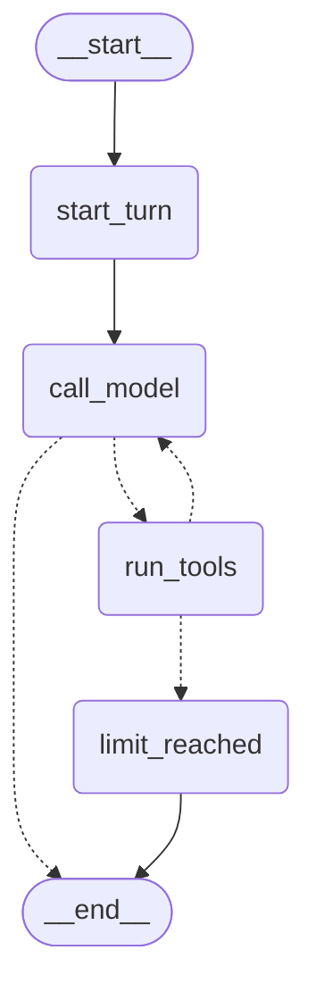

# Milestone 2: LangGraph

**Status:** complete
**Builds:** the M1 Service Desk agent rebuilt as an explicit LangGraph `StateGraph`, with typed state, named nodes, conditional edges, a SQLite checkpointer (conversations survive restarts) and step-by-step streaming.
**Does not build:** interrupts/human approval (M7), subgraphs and multiple agents (M4), RAG, MCP or policy.

The M1 loop (`agents/loop.py`) is kept on purpose. `aegisdesk agent --engine loop` still runs it, and the security tests run against **both** engines. That makes it possible to see exactly what LangGraph changed and what it didn't.

---

## 1. Concepts introduced

| Concept | What it is here | Where |
|---|---|---|
| **State** | One typed dict holding everything a run knows: messages, who the user is, per-turn counters, trajectory | `graphs/state.py` |
| **Reducer** | How a node's update is merged into state. `messages` uses `add_messages` (append); every other key is replaced | `ServiceDeskState` |
| **Node** | A plain function `state → partial update` | `start_turn`, `call_model`, `run_tools`, `limit_reached` |
| **Edge** | A fixed transition | `START → start_turn → call_model`, `limit_reached → END` |
| **Conditional edge** | A function `state → next node name`: the "what next?" decision, made in code | `after_model`, `after_tools` |
| **Checkpointer** | Saves the whole state after every node, keyed by thread | `persistence/checkpointer.py` (SQLite) |
| **Thread** | One persisted conversation, identified by `thread_id` | `--thread` in the CLI |
| **Streaming** | Receiving each node's update as soon as it finishes | `stream_mode="updates"` in `ServiceDeskGraphAgent._stream` |

Still to come: **interrupt** and resume (M7, for approvals), **Command / handoff** and **subgraphs** (M4, multi-agent).

### Topology

Generated by `agent.graph.get_graph().draw_mermaid()`. Dotted arrows are conditional edges.



* `start_turn` resets the per-turn counters and trajectory, and records the thread's owner on the first turn.
* `call_model` adds the system prompt (it is **not** stored in the thread), calls the model with the tools bound, and records usage.
* `after_model`: tool calls → `run_tools`; otherwise → `END`.
* `run_tools` runs each call through the **unchanged M1 `ToolExecutor`**. Calls beyond the tool-call limit are answered with `not_executed`.
* `after_tools`: tool-call limit hit, or `llm_calls ≥ max_steps` → `limit_reached`; otherwise back to `call_model`.
* `limit_reached` appends the same fallback answer as M1.

## 2. Loop vs graph

| Concern | M1 loop | M2 graph |
|---|---|---|
| Where state lives | Local variables inside `run()` | `ServiceDeskState`, checkpointed after every node |
| What happens next | `if`/`for` inside one function | Named nodes plus conditional edges; the topology can be drawn and tested |
| Conversation memory | The caller passes `history` back in | The thread is stored; the caller passes only `thread_id` |
| Survives a restart | No | Yes (SQLite checkpointer) |
| Watching progress | Only after the run ends | Each node's update is streamed as it finishes |
| Runaway protection | Our step and tool-call limits | The same limits, plus LangGraph's `recursion_limit` as a backstop |
| Tools, identity, validation, idempotency | `ToolExecutor` | **The same `ToolExecutor`** |

LangGraph replaced the *control flow and memory*. It did not replace, and must not replace, the **security boundary**. We deliberately don't use the prebuilt `ToolNode` or `create_react_agent`: they would execute tools directly and bypass our executor. For the same reason, the "tool calls or done?" routing is our own code, not LangGraph's `tools_condition`.

## 3. Security considerations that are new in M2

**Threads are data that belongs to someone.** Once conversations are persisted, `thread_id` becomes a resource identifier, and anyone who can guess or obtain one might try to read or extend someone else's conversation. So:

* The first turn records `owner_id` in state.
* `ServiceDeskGraphAgent` checks ownership **before** writing anything to the thread, in application code, not in a node. A stranger's message is therefore never appended to someone else's thread (tested in `tests/integration/test_thread_persistence.py`).
* Another employee's thread is refused with `ThreadAccessError`, for both `run` and `history`.

**The user comes from the caller on every turn.** `user` is part of each turn's input, built from the authenticated session. The model can only add messages; it has no way to write `user`, `owner_id` or the counters.

**No secrets in state.** State is written to disk after every node. It holds messages, claims and bookkeeping; API keys stay in `Settings`.

## 4. Execution path: a thread resumed after a restart

Actual output on the offline fake model, in two separate processes:

```
$ aegisdesk agent --as E1004 --thread demo-1 "What laptop is assigned to me?"
  · step 1 model  in=220 out=1 2ms -> get_my_assets
  · step 1 tool   get_my_assets({}) ok 0.1ms
  · step 2 model  in=224 out=8 1ms -> final answer
Assistant: [fake model] Tool results: {"assets":[{"asset_tag":"NS-LT-0101",...
  [service_desk@0.1.0 ... stop=final_answer llm_calls=2 tool_calls=1 tokens=453 ... thread_id=demo-1]

$ aegisdesk agent --as E1004 --thread demo-1 "Show me ticket INC-1001"      # new process
  · step 1 model  in=236 out=2 1ms -> get_ticket
  ...
$ aegisdesk thread demo-1 --as E1004
human: What laptop is assigned to me?
   ai: [tool calls: get_my_assets({})]
 tool: {"assets":[...
   ai: [fake model] Tool results: ...
human: Show me ticket INC-1001
   ...
$ aegisdesk thread demo-1 --as E1001
Access denied: Thread 'demo-1' belongs to another employee.
```

In the second process, step 1 has `in=236` instead of `in=220`: the model received the stored history from the first process.

What happens in the second invocation:

1. The CLI authenticates E1004 and opens `.aegisdesk/checkpoints.sqlite`.
2. `ServiceDeskGraphAgent.run` loads the latest checkpoint for `demo-1`, confirms `owner_id == E1004`, and only then continues.
3. It streams the graph with the input `{messages: [HumanMessage], user: claims, request_id}`. `add_messages` appends the new message to the stored ones.
4. `start_turn` resets the per-turn counters. `call_model` sends system prompt + stored history + new message. `after_model` routes to `run_tools`. `run_tools` → `ToolExecutor` → `get_ticket` for E1004. `after_tools` routes back to `call_model`, which answers. `after_model` → `END`.
5. After each node the checkpointer writes a new snapshot. The CLI prints trajectory entries as each node's update streams in.
6. `run` reads the final state and returns the same `AgentRun` type as the M1 loop, plus `thread_id`.

`agent.graph.get_state_history(config)` lists every snapshot. `tests/unit/test_graph.py::test_checkpoint_is_saved_after_every_node` checks that there is one per node.

## 5. Libraries introduced

**langgraph**
* *Problem solved:* agent control flow as an explicit, inspectable state machine, with persistence, streaming and (later) interrupts.
* *Abstraction:* `StateGraph` (typed state, reducers, nodes, edges, conditional edges), compiled into a runnable with `invoke`/`stream`/`get_state`.
* *Without it:* we would hand-write state serialisation, a checkpoint store keyed by thread, resumption at the right point, streaming hooks, and later pause/resume for approvals. M1 shows the easy part of that; the persistence and resumption parts are where the work is.
* *Alternatives:* keep the hand-written loop and add a database table for history; a durable-workflow engine such as Temporal; other agent frameworks such as the OpenAI Agents SDK, CrewAI or AutoGen, which are higher level and less explicit.

**langgraph-checkpoint-sqlite**: a checkpointer backed by one local file, so restarts work with no infrastructure. It is replaced by the PostgreSQL checkpointer when the application database arrives.

See [ADR 0004](../adr/0004-why-langgraph.md).

## 6. How to run it

```bash
uv run aegisdesk agent --as E1004 "What laptop is assigned to me?"          # prints a new thread_id
uv run aegisdesk agent --as E1004 --thread <id> "Show me ticket INC-1001"   # continue it
uv run aegisdesk thread <id> --as E1004                                    # read it back
uv run aegisdesk agent --as E1004                                          # interactive, new thread
uv run aegisdesk agent --as E1004 --thread <id>                            # interactive, resumed
uv run aegisdesk agent --as E1004 --engine loop "..."                      # the M1 loop, for comparison
```

Threads are stored in `.aegisdesk/checkpoints.sqlite`, which is git-ignored; change it with `CHECKPOINT_DB_PATH`.

## 7. Test results at the milestone boundary

Run in the development container:

* `uv run ruff check .` and `uv run ruff format --check .`: pass
* `uv run mypy src tests` (strict): no issues in 53 files
* `uv run pytest`: **131 passed, 10 skipped**, and no warnings. New in M2:
  * `tests/unit/test_graph.py`: topology, behaviour, limits, streaming order, one checkpoint per node;
  * `tests/integration/test_thread_persistence.py`: restart survival, thread ownership, and that a refused turn is never written;
  * the security suite parametrised over `loop` and `graph`, so all 10 cases run on both engines (20 tests);
  * CLI tests for resuming across invocations, refused threads, and the loop engine.
* The 10 skipped are the live tests (5 tests × Anthropic/Ollama). No API key or Ollama server was available in the container, so **no real model has run the graph yet.** Run `uv run pytest -m live` locally.

## 8. Known limitations

| Limitation | Addressed in |
|---|---|
| The conversation survives a restart, but the **in-memory ticket repository does not**: a ticket created before a restart is gone afterwards, although the thread still mentions it | PostgreSQL persistence |
| Thread history grows without bound, and every step re-sends all of it | Later (trimming/summarisation); visible now in the `in=` token counts |
| Streaming is per node, not per token | M10 (API streaming) |
| One graph, one agent | M4 (supervisor + specialist subgraphs) |

## 9. What M3 adds

RAG: ingestion, chunking, embeddings, pgvector, a retriever with citations, and RAG evaluation. The agent will answer "How do I configure VPN on macOS?" from Northstar's own documents instead of general knowledge, and will say so when the evidence is insufficient.
